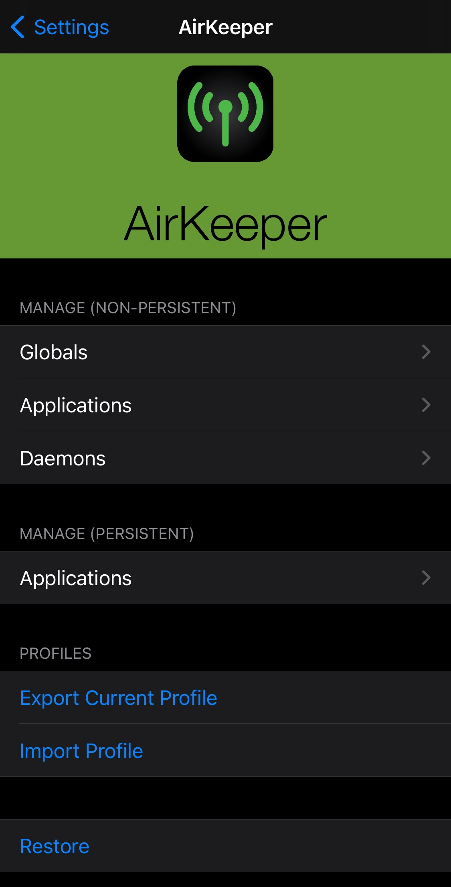
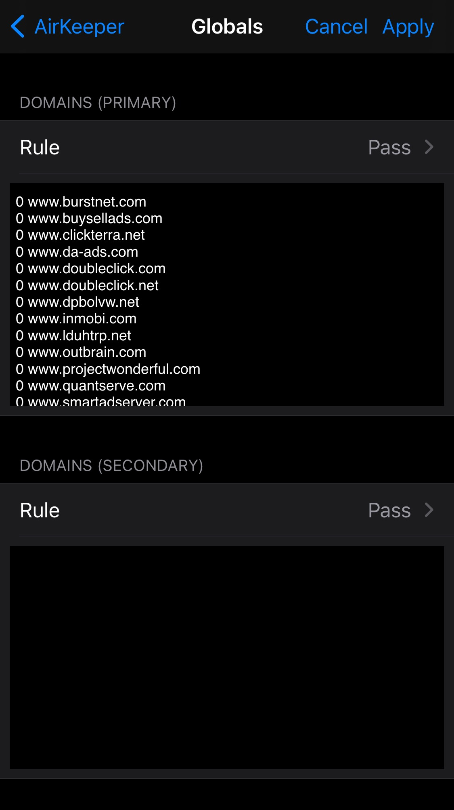
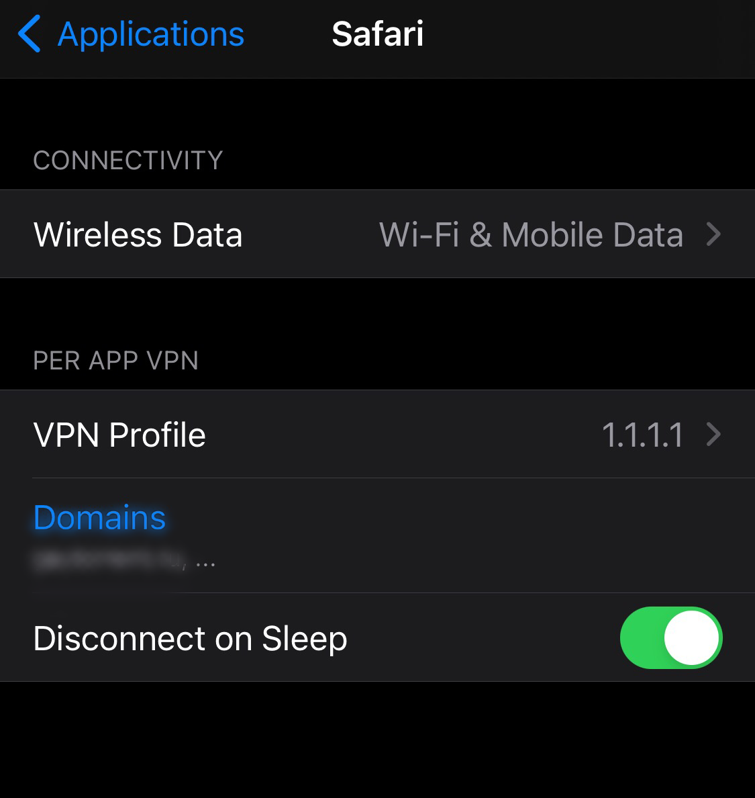
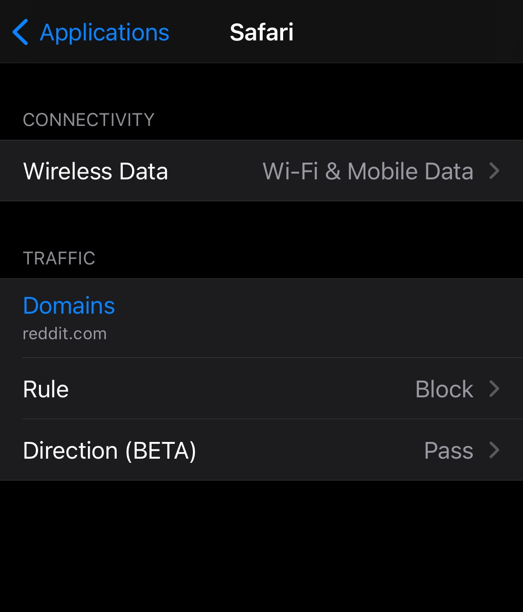

# AirKeeper
This tweak replicates a feature in Chinese iPhone model by using Apple's own private APIs, which effectively writes to /var/preferences/com.apple.networkextension.plist. Either uninstalling this tweak, using the \"Restore\" button in Settings, or delete the file (and userspace reboot) will revert all changes made. The file however store some other configurations, like VPN profiles. This tweak works on both iPhone and iPad (Wi-Fi/Cellular).

|   |   |   ||
|---|---|---|---|

 

 

 

## Compatibility
This package tested to be working on iOS 14.3. Might or might not work on other iOS version.

## Credits
- @insan1d for making this tweak possible

## License
All source code in this repository are licensed under GPLv3, unless stated otherwise.

Copyright (c) 2021 udevs